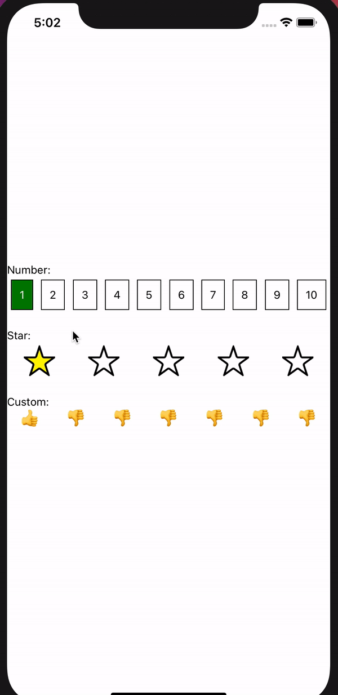

# react-native-user-feedback

Collect feedback from your users for any purpose. `react-native-user-feedback` is a flexible component for iOS and Android that allows you to render star or numeric feedback as well as provide your own custom renderer.



## Installation

```sh
npm install react-native-user-feedback
```

or for `Yarn`

```sh
yarn add react-native-user-feedback
```

## Usage

```js
import UserFeedback from 'react-native-user-feedback';

// ...

<UserFeedback
  maxNumber={10}
  rating={numberRating}
  onRatingChanged={setNumberRating}
  renderRating={Number}
/>;
```

| Prop            | Description                               | Type       | Default |
| --------------- | ----------------------------------------- | ---------- | ------- |
| maxNumber       | the maximum range of the feedback         | `number`   | 5       |
| rating          | The current rating                        | `number`   | 0       |
| onRatingChanged | called when the user selects a new rating | `function` | `null`  |
| renderRating    | callback for custom ratings               | `function` | `Star`  |

## Provided Renderers

### Star

Provides a star based interface for feedback

Usage:
Usage:

```
import { Star } from "react-native-user-feedback"

<UserFeedback
  maxNumber={10}
  rating={numberRating}
  onRatingChanged={setNumberRating}
  renderRating={Star}
/>;
```

### Number

Provides a numeric interface for feedback

Usage:

```
import { Number } from "react-native-user-feedback"

<UserFeedback
  maxNumber={10}
  rating={numberRating}
  onRatingChanged={setNumberRating}
  renderRating={Number}
/>;
```

## Contributing

See the [contributing guide](CONTRIBUTING.md) to learn how to contribute to the repository and the development workflow.

## License

MIT
